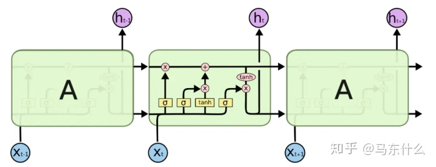

#LocallyConnected1D
1D 输入的局部连接层。
LocallyConnected1D 层与 Conv1D 层的工作方式相同，除了权值不共享外， 
也就是说，在输入的每个不同部分应用不同的一组过滤器。
##作用：
当图像局部相似匹配时，我们就应该期望在图片的不同位置学习到完全不同的特征。
当数据集具有全局的局部特征分布时，也就是说局部特征之间有较强的相关性，适合用全卷积。
在不同的区域有不同的特征分布时，适合用local-Conv。

#Add≠add
作用：都是计算输入张量列表的和。
但用法不同
added = keras.layers.Add()([x1, x2]) 

added = keras.layers.add([x1, x2])

它接受一个张量的列表， 所有的张量必须有相同的输入尺寸， 然后返回一个张量（和输入张量尺寸相同）。

#MaxPooling1D
为什么2，3不行  >>>>>>>大了就没有了后续

对于时序数据的最大池化。

参数
pool_size: 整数，最大池化的窗口大小。
strides: 整数，或者是 None。作为缩小比例的因数。 例如，2 会使得输入张量缩小一半。

#RNN参数
1.kernel_initializer: kernel 权值矩阵的初始化器， 用于**输入**的线性转换

2.recurrent_initializer: recurrent_kernel 权值矩阵 的初始化器，用于**循环层**状态的线性转换

###### 3.go_backwards: 布尔值 (默认 False)。 如果为 True，则向后处理输入序列并返回相反的序列。**_bi??_**

4.stateful: 布尔值 (默认 False)。 如果为 True，则批次中索引 i 处的每个样品的最后状态 将用作下一批次中索引 i 样品的初始状态。

5.unroll: 布尔值 (默认 False)。 如果为 True，则网络将展开，否则将使用符号循环。 展开可以加速 RNN，但它往往会占用更多的内存。 展开只适用于短序列。


#ConvLSTM2D
输入、循环先卷积


#LSTMCell

##lstm


而LSTM则是LSTMcell在时间上的扩展

LSTMcell的设定更多的是为方便继承和魔改，提高了更大的灵活性，实际上如果仅仅是调用：

RNN(LSTMCell(10)) 和 LSTM(10) 是没有区别的

#Input参数
Input() 用于实例化 Keras 张量。

1.shape: 一个尺寸元组（整数），不包含批量大小。 例如，shape=(32,) 表明期望的输入是按批次的 32 维向量
**_维度而非特征数量！！！！？？？？_**

#reshape
```python
# 作为 Sequential 模型的第一层
model = Sequential()
model.add(Reshape((3, 4), input_shape=(12,)))
# 现在：model.output_shape == (None, 3, 4)
# 注意： `None` 是批表示的维度

# 作为 Sequential 模型的中间层
model.add(Reshape((6, 2)))
# 现在： model.output_shape == (None, 6, 2)

# 还支持使用 `-1` 表示维度的尺寸推断
model.add(Reshape((-1, 2, 2)))
# 现在： model.output_shape == (None, 3, 2, 2)
```


#Permute
```python
model = Sequential()
model.add(Permute((2, 1), input_shape=(10, 64)))
# 现在： model.output_shape == (None, 64, 10)
# 注意： `None` 是批表示的维度
```
用法：RNN\CNN互换，连接


#Lambda
```python
# 添加一个网络层，返回输入的正数部分
# 与负数部分的反面的连接

def antirectifier(x):
    x -= K.mean(x, axis=1, keepdims=True)
    x = K.l2_normalize(x, axis=1)
    pos = K.relu(x)
    neg = K.relu(-x)
    return K.concatenate([pos, neg], axis=1)

def antirectifier_output_shape(input_shape):
    shape = list(input_shape)
    assert len(shape) == 2  # only valid for 2D tensors
    shape[-1] *= 2
    return tuple(shape)

model.add(Lambda(antirectifier,
                 output_shape=antirectifier_output_shape))


```
__参数__

- __function__: 需要封装的函数。
将输入张量或张量序列作为第一个参数。
- __output_shape__: 预期的函数输出尺寸。
    只在使用 Theano 时有意义。
    可以是元组或者函数。
    如果是元组，它只指定第一个维度；
        样本维度假设与输入相同：
        `output_shape = (input_shape[0], ) + output_shape`
        或者，输入是 `None` 且样本维度也是 `None`：
        `output_shape = (None, ) + output_shape`
        如果是函数，它指定整个尺寸为输入尺寸的一个函数：
        `output_shape = f(input_shape)`
- __mask__: 要么是 None (表示无 masking)，要么是一个张量表示用于 Embedding 的输入 mask。
- __arguments__: 可选的需要传递给函数的关键字参数。


#core(意思是常用层)
### RepeatVector

```python
keras.layers.RepeatVector(n)
```

将输入重复 n 次。

__示例__


```python
model = Sequential()
model.add(Dense(32, input_dim=32))
# 现在： model.output_shape == (None, 32)
# 注意： `None` 是批表示的维度

model.add(RepeatVector(3))
# 现在： model.output_shape == (None, 3, 32)
```
### Masking

```python
keras.layers.Masking(mask_value=0.0)
```

使用覆盖值覆盖序列，以跳过时间步。

如果一个给定的样本时间步的所有特征都等于 `mask_value`，
那么这个时间步将在所有下游层被覆盖 (跳过)
（只要它们支持覆盖）。

如果任何下游层不支持覆盖但仍然收到此类输入覆盖信息，会引发异常。

这个时候就是Mask层派上用场的时候了。

Mask(0)经过Mask后，可以忽略X_data中所有的0，
当然，把后面补的0去掉是可以理解的。

那如果句中有0呢？
一般情况下，如文本处理，会把文本映射成index，
这样最大的好处就是节约空间。
有些大文本数据，几百个G，经过了index映射，
也就还剩几个G。

这是题外话了，我们在keras的Embedding层会讲的。
而这个时候index中的0,往往是一些无法转成词向量的低频词，
这些词没有词向量，去掉对整个文本的处理也没有影响，
所以在Mask中和补上的0一起忽略就好啦。

这里的忽略是什么意思呢？也就是不处理。

很多朋友以为Mask后会直接把0去掉。其实不是的。

可以做一些实验，如model的Mask后接个LSTM层，
对LSTM输出每个时间步的值，发现，如果设置了Mask层，
则上面[1,2,3,4,5,00000]的数据处理结果，
前5位是经过了计算，补0的对应的位置的值，和
第5位的值相同，也就是说LSTM对后面补0的位置并没有计算。


### SpatialDropout2D

```python
keras.layers.SpatialDropout2D(rate, data_format=None)
```

SpatialDropout是Tompson等人在图像领域提出的一种dropout方法。

普通的dropout会随机地将部分元素置零，

而SpatialDropout会随机地将部分区域置零，
该dropout方法在图像识别领域实践证明是有效的。


#编写自定义层
##1.数据变换函数call
层的数据变化的方式，dot.mean,max,min等都在这一层
##2.权重函数build
为该层创建一个可训练的权重
##3.张量变换层compute_output_shape
```python
from keras import backend as K
from keras.engine.topology import Layer

class MyLayer(Layer):

    def __init__(self, output_dim, **kwargs):
        self.output_dim = output_dim
        super(MyLayer, self).__init__(**kwargs)

    def build(self, input_shape):
        # 为该层创建一个可训练的权重
        self.kernel = self.add_weight(name='kernel', 
                                      shape=(input_shape[1], self.output_dim),
                                      initializer='uniform',
                                      trainable=True)
        super(MyLayer, self).build(input_shape)  # 一定要在最后调用它

    def call(self, x):
        #一般而言，更换这一层的处理函数即可，如mean
        return K.dot(x, self.kernel)

    def compute_output_shape(self, input_shape):
        return (input_shape[0], self.output_dim)
```
